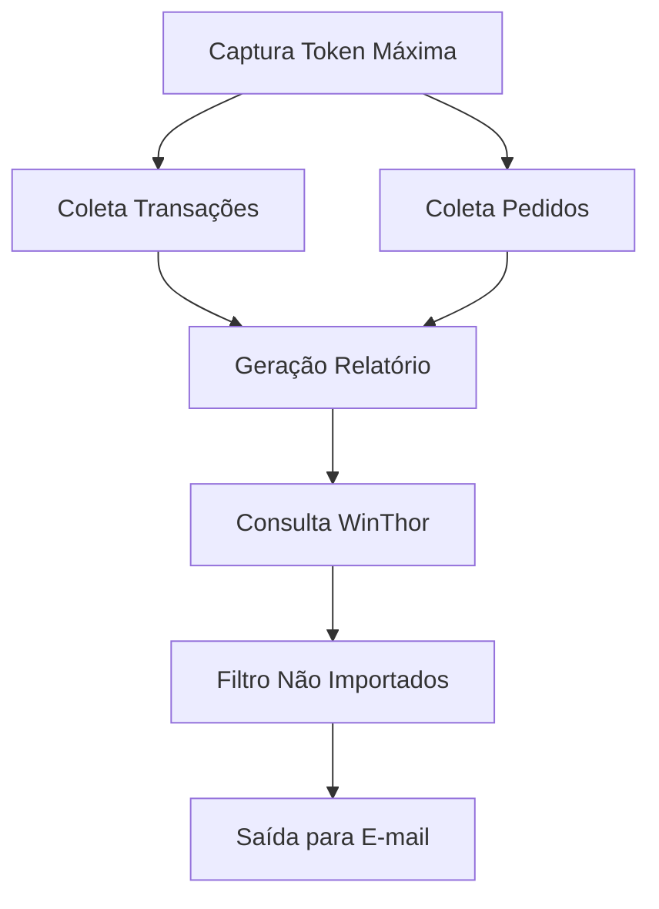

# ROBO - Pedidos Rejeitados

## Visão Geral

Este projeto automatiza a coleta, cruzamento e análise de pedidos e transações financeiras entre a plataforma Máxima e o sistema WinThor, gerando relatórios diários e identificando pedidos não importados. O objetivo é facilitar o acompanhamento de pedidos rejeitados e garantir a integridade dos dados entre os sistemas.

---

## Arquitetura de Pastas

```text
├── main.py                  # Script principal de orquestração
├── config.py                # Configurações globais (URLs, credenciais, etc.)
├── .env                     # Variáveis de ambiente (tokens)
├── .env.example             # Exemplo de configuração de ambiente
├── requirements.txt         # Dependências do projeto
├── pedidos/                 # Armazena arquivos JSON de pedidos coletados
│   └── pedidos_YYYY-MM-DD_HH-MM-SS.json
├── relatorios/              # Relatórios diários gerados
│   └── relatorio_YYYY-MM-DD.json
├── transactions/            # Transações financeiras coletadas
│   └── transactions_YYYY-MM-DD_HH-MM-SS.json
├── winthor/                 # Pedidos importados do WinThor
│   └── pedidos_winthor_YYYY-MM-DD.json
├── services/                # Serviços de integração e processamento
│   ├── filtro_importacao_service.py
│   ├── maxima_service.py
│   ├── pedidos_service.py
│   ├── pedidos_winthor_service.py
│   ├── relatorio_service.py
│   └── transacoes_service.py
└── ...                      # Outros arquivos e pastas auxiliares

> **Nota:** Pastas de cache como `__pycache__` não existem mais no projeto. Recomenda-se sempre removê-las antes de versionar ou distribuir o código.
```

---

## Fluxo de Funcionamento

1. **Autenticação**: Captura o token de acesso à API Máxima via Selenium.
2. **Coleta de Dados**: Busca transações financeiras e pedidos do dia na Máxima.
3. **Geração de Relatório**: Cruza dados de pedidos e transações, enriquecendo com informações de usuário e supervisor.
4. **Verificação WinThor**: Consulta pedidos já importados no WinThor.
5. **Filtro de Não Importados**: Identifica transações não localizadas no WinThor e salva para posterior envio por e-mail.

---

## Principais Serviços

- **maxima_service.py**: Automatiza login e captura de token na plataforma Máxima usando Selenium.
- **transacoes_service.py**: Coleta transações financeiras do dia via API.
- **pedidos_service.py**: Busca todos os pedidos do dia via API, com paginação otimizada.
- **relatorio_service.py**: Cruza pedidos e transações, gerando relatório diário detalhado.
- **pedidos_winthor_service.py**: Consulta pedidos já importados no WinThor e salva em JSON.
- **filtro_importacao_service.py**: Compara relatório diário com pedidos do WinThor, filtrando não importados.

---

## Exemplo de Fluxo (Diagrama)



---

## Exemplo de Relatório Gerado

Arquivo: `relatorios/relatorio_YYYY-MM-DD.json`

```json
{
  "transacoes": [
    {
      "nomeFilial": "Filial 1",
      "nomeCliente": "Cliente X",
      "codigoPedidoMaxima": "12345",
      "valor": 100.0,
      "usuario": {"codigo": "U01", "nome": "Vendedor A"},
      "supervisor": {"codigo": "S01", "nome": "Supervisor B"}
    },
    ...
  ]
}
```

---

## Requisitos

- Python 3.8+
- Selenium
- WebDriver Manager
- Requests
- python-dotenv

Instale as dependências com:

```bash
pip install -r requirements.txt
```

---

## Execução

1. Configure o arquivo `.env` com as variáveis necessárias (tokens).
2. Ajuste as credenciais e URLs em `config.py`.
3. Execute o script principal:

```bash
python main.py
```

---

## Limpeza de Cache

Para manter o projeto limpo, remova pastas de cache Python antes de versionar ou distribuir:

```powershell
Remove-Item -Recurse -Force __pycache__
Remove-Item -Recurse -Force services\__pycache__
```

---

---

## Observações de Segurança
- **NUNCA** compartilhe seu `.env` ou credenciais.
- Tokens e senhas são sensíveis e devem ser protegidos.

---

## Screenshots e Exemplos

> **Adicione aqui prints do terminal, exemplos de arquivos JSON gerados e telas do sistema para enriquecer a documentação.**

---

## Autor
- Desenvolvido por Hudson (EBD Grupo)

---

## Licença
Este projeto é privado e para uso interno.
